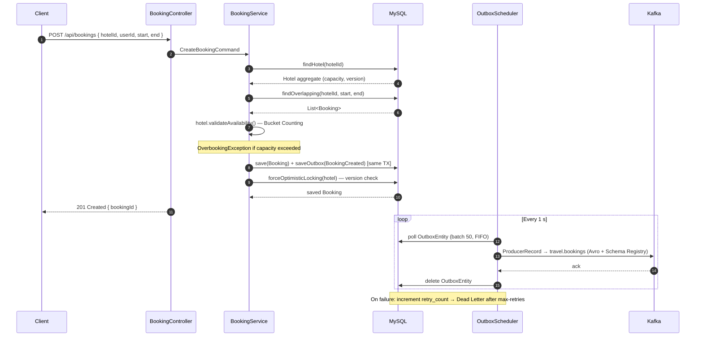
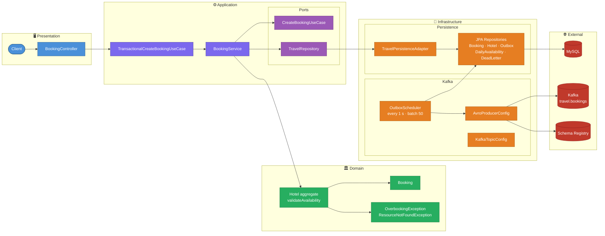

# ✈️ Travel Agency — Command Side (CQRS Write Model)

[](https://spring.io/projects/spring-boot)
[](https://openjdk.org/)
[](https://kafka.apache.org/)
[](https://avro.apache.org/)
[](https://www.docker.com/)
[](https://opensource.org/licenses/MIT)

<a id="overview"></a>
## 📖 Overview
[Back to Table of Contents](#toc)

Travel Agency Command Side is the write model of a CQRS-based hotel booking platform. It handles all booking creation commands — validating availability via a Bucket Counting algorithm, enforcing Optimistic Locking for concurrency control, and publishing `BookingCreated` events to Kafka via the Transactional Outbox Pattern. Built on Hexagonal Architecture with a clean separation between domain, application, and infrastructure layers.

<a id="toc"></a>
## 📚 Table of Contents
- [📖 Overview](#overview)
- [🔄 How It Works](#how-it-works)
- [🌐 API Endpoints](#api-endpoints)
- [🚀 Getting Started](#getting-started)
- [⚙️ Environment Variables](#environment-variables)
- [🛠️ Common Issues](#common-issues)
- [🏗️ Architecture](#architecture)
- [💻 Tech Stack](#tech-stack)
- [🧪 Testing Strategy](#testing-strategy)
- [📂 Repository Structure](#repository-structure)
- [🤝 Contact](#contact)

---

<a id="how-it-works"></a>
## 🔄 How It Works
[Back to Table of Contents](#toc)

1. Client sends `POST /api/bookings` with hotel ID, user ID, and desired dates
2. `BookingController` maps the request to a `CreateBookingCommand` and delegates to `CreateBookingUseCase`
3. `TransactionalCreateBookingUseCase` wraps the entire operation in a single DB transaction
4. `BookingService` fetches the `Hotel` aggregate and the list of overlapping bookings from the DB
5. `Hotel.validateAvailability()` runs the **Bucket Counting algorithm** — checks occupancy per day and throws `OverbookingException` if capacity is exceeded
6. The new `Booking` is persisted and an `OutboxEntity` record is saved **in the same transaction** (Transactional Outbox Pattern)
7. Optimistic Locking is applied on the `Hotel` aggregate to detect concurrent conflicting writes
8. `OutboxScheduler` polls the outbox table every second, serialises pending entries to `BookingCreatedAvro`, and publishes them to the `travel.bookings` Kafka topic
9. On publish failure the entry's retry counter is incremented; after `max-retries` the message is moved to the **Dead Letter** table



---

<a id="api-endpoints"></a>
## 🌐 API Endpoints
[Back to Table of Contents](#toc)

**Base URL:** `http://localhost:8080`

### Booking Endpoints

| Method | Path | Purpose | Request Body | Success | Common Errors |
|--------|------|---------|--------------|---------|---------------|
| `POST` | `/api/bookings` | Create a new booking | `CreateBookingRequestDto` | `201 Created` | `400`, `409` |

### Request Body — `CreateBookingRequestDto`

| Field | Type | Constraints | Description |
|-------|------|-------------|-------------|
| `hotelId` | `Long` | `@NotNull` | ID of the hotel to book |
| `userId` | `Long` | `@NotNull` | ID of the user making the booking |
| `start` | `LocalDate` | `@NotNull @Future` | Check-in date |
| `end` | `LocalDate` | `@NotNull @Future` | Check-out date |

### Health Endpoint

| Method | Path | Purpose | Success |
|--------|------|---------|---------| 
| `GET` | `/actuator/health` | Application health check | `200 OK` |

### cURL Example

```bash
curl -X POST http://localhost:8080/api/bookings \
  -H "Content-Type: application/json" \
  -d '{
    "hotelId": 1,
    "userId": 42,
    "start": "2026-08-01",
    "end": "2026-08-07"
  }'
```

**Response `201 Created`:**
```json
{ "bookingId": 17 }
```

**Response `409 Conflict`** (hotel fully booked on any day in range):
```json
{
  "status": 409,
  "error": "Hotel 1 overbooked on date 2026-08-03. Capacity: 2"
}
```

---

<a id="getting-started"></a>
## 🚀 Getting Started
[Back to Table of Contents](#toc)

### Prerequisites

- Docker and Docker Compose v2+
- Java 25+ and Maven 3.9+ (for local builds only)
- Kafka broker reachable at `kafka:9092` (included in the Compose stack)
- Confluent Schema Registry reachable at `http://schema-registry:8200`

### Environment Configuration

Create a `.env` file in the project root (see [Environment Variables](#environment-variables) for all options):

```dotenv
# ─── MySQL ───────────────────────────────────────────────────────────────────
TA_COMMAND_SIDE_SERVICE_MYSQL_DB_HOST=travel-agency-command-side-mysql
TA_COMMAND_SIDE_SERVICE_MYSQL_DB_PORT=3307
TA_COMMAND_SIDE_SERVICE_MYSQL_DB_NAME=travels_db
TA_COMMAND_SIDE_SERVICE_MYSQL_DB_USER=user
TA_COMMAND_SIDE_SERVICE_MYSQL_DB_ROOT_PASSWORD=changeme_root
TA_COMMAND_SIDE_SERVICE_MYSQL_DB_PASSWORD=changeme_user

# ─── Application ─────────────────────────────────────────────────────────────
TA_COMMAND_SIDE_SERVICE_PORT=8080
TA_COMMAND_SIDE_SERVICE_APPLICATION_NAME=travel-agency-command-side

# ─── Kafka ───────────────────────────────────────────────────────────────────
KAFKA_CLUSTER_ID=MkU3OEVBNTcwNTJENDM2Qk
KAFKA_BROKER_ID=1
KAFKA_ADVERTISED_LISTENERS=PLAINTEXT://kafka:9092
```

### Start the Service

```bash
docker compose up -d --build
```

Verify: `curl http://localhost:8080/actuator/health` → `{"status":"UP"}`

---

<a id="environment-variables"></a>
## ⚙️ Environment Variables
[Back to Table of Contents](#toc)

### MySQL

| Variable | Required | Description | Example |
|----------|----------|-------------|---------|
| `TA_COMMAND_SIDE_SERVICE_MYSQL_DB_HOST` | yes | MySQL hostname (Docker service name) | `travel-agency-command-side-mysql` |
| `TA_COMMAND_SIDE_SERVICE_MYSQL_DB_PORT` | yes | Host port mapped to MySQL 3306 | `3307` |
| `TA_COMMAND_SIDE_SERVICE_MYSQL_DB_NAME` | yes | Database name | `travels_db` |
| `TA_COMMAND_SIDE_SERVICE_MYSQL_DB_USER` | yes | Application DB user | `user` |
| `TA_COMMAND_SIDE_SERVICE_MYSQL_DB_ROOT_PASSWORD` | yes | MySQL root password | `root1234` |
| `TA_COMMAND_SIDE_SERVICE_MYSQL_DB_PASSWORD` | yes | Application DB user password | `user1234` |

### Application

| Variable | Required | Description | Example |
|----------|----------|-------------|---------|
| `TA_COMMAND_SIDE_SERVICE_PORT` | yes | HTTP port the service listens on | `8080` |
| `TA_COMMAND_SIDE_SERVICE_APPLICATION_NAME` | optional | Spring application name | `travel-agency-command-side` |

### Kafka

| Variable | Required | Description | Example |
|----------|----------|-------------|---------|
| `KAFKA_CLUSTER_ID` | yes | KRaft cluster ID | `MkU3OEVBNTcwNTJENDM2Qk` |
| `KAFKA_BROKER_ID` | yes | Broker ID | `1` |
| `KAFKA_ADVERTISED_LISTENERS` | yes | Advertised listener address | `PLAINTEXT://kafka:9092` |
| `KAFKA_HEAP_OPTS` | optional | JVM heap for Kafka broker | `-Xmx512M -Xms512M` |

---

<a id="common-issues"></a>
## 🛠️ Common Issues
[Back to Table of Contents](#toc)

1. **Application fails to start — DB connection refused** — MySQL healthcheck must pass before the app starts. Check with `docker compose ps travel-agency-command-side-mysql` and `docker compose logs travel-agency-command-side-mysql`. The app waits for the healthcheck condition in `docker-compose.yml`.

2. **`OverbookingException` on every request** — the hotel's capacity in the DB may be 0 or the `daily_availability` table is out of sync. Verify the `Hotel` record exists and has `capacity > 0`.

3. **Outbox messages stuck / not published** — check Schema Registry is reachable at `http://schema-registry:8200`. Inspect `docker compose logs travel-agency-command-side` for Kafka producer errors. After `max-retries` (default 5) messages move to the dead letter table — query `SELECT * FROM dead_letter` to inspect failures.

4. **Optimistic Locking exception under load** — concurrent booking requests for the same hotel may trigger `OptimisticLockException`. The client should retry the request; this is by design. Consider reducing concurrency at the load-balancer level for a single hotel if retries are frequent.

5. **Port conflict** — check for conflicts on `3307` (MySQL) and `8080` (app): `netstat -ano | findstr :3307`.

---

<a id="architecture"></a>
## 🏗️ Architecture
[Back to Table of Contents](#toc)



**Technical Highlights:**

- **Hexagonal Architecture (Ports & Adapters):** Domain and application layers have zero infrastructure dependencies — `TravelRepository` port is the only bridge, implemented by `TravelPersistenceAdapter`.
- **CQRS Write Model:** This service handles only commands. All reads are delegated to a separate query-side service consuming events from Kafka.
- **Bucket Counting Algorithm:** `Hotel.validateAvailability()` checks occupancy per day in O(N×D) — linear in the number of overlapping bookings, with D bounded by business constraints (typical stays of 1–30 days).
- **Transactional Outbox Pattern:** `Booking` and `OutboxEntity` are persisted in one DB transaction — guarantees at-least-once Kafka delivery even if the broker is temporarily unavailable.
- **Optimistic Locking:** The `Hotel` aggregate carries a JPA `@Version` field. Concurrent booking attempts for the same hotel are serialised by the DB — conflicting writes are rejected with `OptimisticLockException`.
- **Dead Letter Table:** Failed Kafka publishes are retried up to `max-retries` times; after that the record is moved to `dead_letter` for manual inspection and reprocessing.
- **Virtual Threads + container-aware JVM:** `spring.threads.virtual.enabled=true` with `-XX:+UseContainerSupport -XX:MaxRAMPercentage=75.0 -XX:+UseG1GC`.
- **JDBC Batching:** Hibernate batch size 50 with `order_inserts=true` and `order_updates=true` for efficient bulk writes.

---

<a id="tech-stack"></a>
## 💻 Tech Stack
[Back to Table of Contents](#toc)

| Layer | Technology |
|-------|------------|
| Language | Java 25 (virtual threads via Project Loom) |
| Framework | Spring Boot 4.0.6 |
| Web | Spring WebMVC, Spring Validation |
| Persistence | Spring Data JPA, Hibernate (batch writes) |
| Database | MySQL |
| Messaging | Apache Kafka (KRaft, no ZooKeeper) |
| Schema | Apache Avro 1.11.3, Confluent Schema Registry 7.6.0 |
| Serialisation | `kafka-avro-serializer`, `BookingCreatedAvro` generated from `.avsc` |
| Scheduling | Spring `@Scheduled` (OutboxScheduler — fixed delay 1 s) |
| Build | Maven 3.9, multi-stage Docker build |
| Containerisation | Docker, Docker Compose v2+, non-root user, layer extraction |
| Observability | Spring Boot Actuator (`/actuator/health`) |
| Utilities | Lombok |

---

<a id="testing-strategy"></a>
## 🧪 Testing Strategy
[Back to Table of Contents](#toc)

**4 unit test classes** — plain JUnit 5, no Spring context loaded.

| Class | Key Scenarios |
|-------|--------------|
| `CreateBookingCommandTest` | Command construction, validation of field constraints |
| `BookingServiceTest` | Happy path, `OverbookingException` on full hotel, `ResourceNotFoundException` on missing hotel, date order validation |
| `OutboxSchedulerTest` | Successful publish + delete, retry on failure, dead-letter promotion after max retries |
| `OutboxEntityTest` | Entity construction, retry counter increment, status transitions |

```bash
mvn test        # unit tests only
mvn verify      # unit tests + reports
```

---

<a id="repository-structure"></a>
## 📂 Repository Structure
[Back to Table of Contents](#toc)

```text
.
├── src/
│   ├── main/
│   │   ├── avro/
│   │   │   └── BookingCreated.avsc               # Avro schema → BookingCreatedAvro.java
│   │   ├── java/com/rzodeczko/
│   │   │   ├── application/
│   │   │   │   ├── command/
│   │   │   │   │   └── CreateBookingCommand.java
│   │   │   │   ├── port/
│   │   │   │   │   ├── in/  CreateBookingUseCase.java
│   │   │   │   │   └── out/ TravelRepository.java
│   │   │   │   └── service/
│   │   │   │       └── BookingService.java        # Core booking logic + availability check
│   │   │   ├── domain/
│   │   │   │   ├── exception/
│   │   │   │   │   ├── OverbookingException.java
│   │   │   │   │   └── ResourceNotFoundException.java
│   │   │   │   └── model/
│   │   │   │       ├── Booking.java               # record
│   │   │   │       └── Hotel.java                 # aggregate — validateAvailability()
│   │   │   ├── infrastructure/
│   │   │   │   ├── configuration/
│   │   │   │   │   ├── BeansConfiguration.java
│   │   │   │   │   ├── SchedulingConfiguration.java
│   │   │   │   │   └── serializer/
│   │   │   │   │       ├── CustomLocalDateSerializer.java
│   │   │   │   │       └── CustomLocalDateDeserializer.java
│   │   │   │   ├── kafka/
│   │   │   │   │   ├── outbox/  OutboxScheduler.java
│   │   │   │   │   ├── producer/ AvroProducerConfig.java
│   │   │   │   │   ├── properties/ KafkaTopicProperties.java · OutboxProperties.java
│   │   │   │   │   └── topic/   KafkaTopicConfig.java
│   │   │   │   ├── persistence/
│   │   │   │   │   ├── adapter/  TravelPersistenceAdapter.java
│   │   │   │   │   ├── entity/   BookingEntity · HotelEntity · OutboxEntity
│   │   │   │   │   │             DailyAvailabilityEntity · DeadLetterEntity
│   │   │   │   │   ├── mapper/   TravelMapper.java
│   │   │   │   │   └── repository/ JpaBookingRepository · JpaHotelRepository
│   │   │   │   │                   JpaOutboxRepository · JpaDailyAvailabilityRepository
│   │   │   │   │                   JpaDeadLetterRepository
│   │   │   │   └── tx/
│   │   │   │       └── TransactionalCreateBookingUseCase.java
│   │   │   ├── presentation/
│   │   │   │   ├── controller/  BookingController.java
│   │   │   │   ├── dto/         CreateBookingRequestDto · CreateBookingResponseDto · ErrorResponseDto
│   │   │   │   └── exception/   GlobalExceptionHandler.java
│   │   │   └── TravelAgencyCommandSideApplication.java
│   │   └── resources/
│   │       └── application.yaml
│   └── test/
│       └── java/com/rzodeczko/
│           ├── application/
│           │   ├── command/  CreateBookingCommandTest.java
│           │   └── service/  BookingServiceTest.java
│           └── infrastructure/
│               ├── kafka/outbox/  OutboxSchedulerTest.java
│               └── persistence/entity/ OutboxEntityTest.java
├── .env                                           # Environment variables (not committed)
├── docker-compose.yml                             # MySQL + Kafka KRaft + Schema Registry + app
├── Dockerfile                                     # Multi-stage build (maven → jre-alpine, non-root)
├── pom.xml
└── README.md
```

---

<a id="contact"></a>
## 🤝 Contact
[Back to Table of Contents](#toc)

Designed and implemented by **Michał Rzodeczko**.

GitHub: [mrzodeczko-dev](https://github.com/mrzodeczko-dev)
